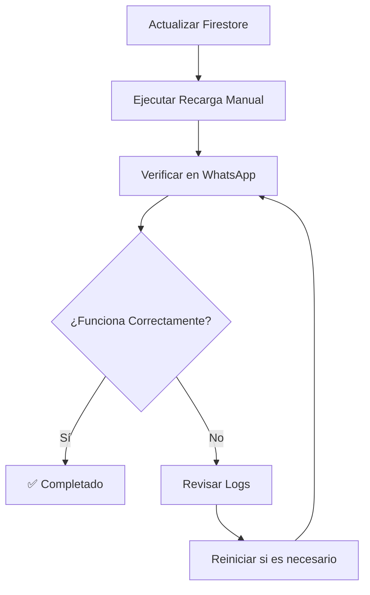

# 🚂 Guía de Sincronización Railway - Firestore

Esta guía explica cómo manejar la sincronización entre Railway y Firestore cuando actualizas datos en la base de datos.

## 🔍 **El Problema**

Cuando actualizas datos en **Firestore** (como cambiar `adminPhone`), el servidor en **Railway** no se entera automáticamente porque:

1. **Cache Local**: Railway carga los clientes una sola vez al iniciar
2. **Sin Notificaciones**: No hay webhooks que notifiquen cambios en Firestore
3. **Entornos Separados**: Railway y tu entorno local son independientes

## ✅ **Soluciones Implementadas**

### **1. Recarga Automática (Nueva)**

El sistema ahora recarga automáticamente los clientes:
- **Cada 30 minutos** automáticamente
- **Al iniciar el servidor** 
- **Manual** via endpoint `/clients/reload`

### **2. Script de Recarga Manual**

```bash
# Usar el script con tu URL de Railway
./railway-reload.sh https://tu-app.railway.app

# Con información detallada
./railway-reload.sh https://tu-app.railway.app --verbose
```

### **3. Endpoint de Recarga**

```bash
# Recargar clientes via API
curl -X POST https://tu-app.railway.app/clients/reload

# Verificar estado
curl https://tu-app.railway.app/clients/status
```

## 🛠️ **Pasos para Actualizar Railway**

### **Opción A: Script Automático (Recomendado)**

1. **Edita la URL** en `railway-reload.sh`:
   ```bash
   RAILWAY_URL=${1:-"https://tu-app-real.railway.app"}
   ```

2. **Ejecuta el script**:
   ```bash
   ./railway-reload.sh
   ```

3. **Verifica el resultado**:
   ```
   🎉 ¡Railway actualizado correctamente!
   ```

### **Opción B: Reinicio Manual**

1. Ve al **Dashboard de Railway**
2. Encuentra tu aplicación
3. Haz clic en **"Redeploy"** o **"Restart"**
4. Espera a que se reinicie

### **Opción C: Endpoint Directo**

```bash
# Recargar clientes
curl -X POST https://tu-app.railway.app/clients/reload

# Verificar estado
curl https://tu-app.railway.app/clients/status
```

## 📊 **Verificación**

### **Verificar que Funcionó**

1. **En WhatsApp**, envía el comando:
   ```
   #0zpVFmWP3inlc2U68RRc /info
   ```

2. **Debería mostrar**:
   ```
   📞 Admin: 5216183045331@c.us  ✅ (Número actualizado)
   ```

3. **Si aún muestra el número anterior**:
   - Ejecuta la recarga manual
   - Verifica que el servidor esté funcionando
   - Revisa los logs de Railway

## 🔧 **Configuración Avanzada**

### **Cambiar Intervalo de Recarga**

En `src/index.js`, modifica:

```javascript
// Recargar cada 15 minutos en lugar de 30
const AUTO_RELOAD_INTERVAL = 15 * 60 * 1000; // 15 minutos
```

### **Recarga en Ciertos Horarios**

```javascript
// Recargar solo en horario laboral
const now = new Date();
const hour = now.getHours();
if (hour >= 9 && hour <= 18) {
    autoReloadClients();
}
```

## 🚨 **Troubleshooting**

### **Error: "No se puede conectar al servidor"**

1. **Verifica la URL** de Railway
2. **Confirma que el servidor esté funcionando**
3. **Revisa los logs** en el dashboard de Railway

### **Error: "Railway aún no está actualizado"**

1. **Ejecuta la recarga manual**:
   ```bash
   ./railway-reload.sh https://tu-app.railway.app
   ```

2. **Verifica en Firestore** que el cambio esté guardado
3. **Reinicia el servidor** en Railway si es necesario

### **Error: "Endpoint no encontrado"**

1. **Verifica que el código esté desplegado** en Railway
2. **Confirma que el endpoint `/clients/reload` existe**
3. **Revisa los logs** del servidor

## 📈 **Monitoreo**

### **Logs a Buscar**

En los logs de Railway, busca:

```
🔄 Recarga automática de clientes iniciada...
✅ Recarga automática completada
📋 Clientes cargados desde Firebase: [clientIds]
```

### **Alertas Recomendadas**

1. **Monitorear** que la recarga automática funcione
2. **Alertar** si hay errores de conexión con Firestore
3. **Notificar** cuando se detecten cambios importantes

## 🎯 **Mejores Prácticas**

### **Antes de Hacer Cambios**

1. **Notifica** al equipo sobre cambios importantes
2. **Documenta** qué se va a cambiar
3. **Prepara** el script de recarga

### **Después de Hacer Cambios**

1. **Ejecuta** la recarga manual inmediatamente
2. **Verifica** que el cambio se refleje
3. **Prueba** la funcionalidad en WhatsApp
4. **Documenta** el cambio realizado

### **Mantenimiento Regular**

1. **Revisa** los logs de recarga automática
2. **Verifica** que Firestore esté sincronizado
3. **Actualiza** la documentación según sea necesario

## 🔄 **Flujo de Trabajo Recomendado**



---

**💡 Consejo**: Siempre ejecuta la recarga manual después de cambios importantes en Firestore para asegurar que Railway esté sincronizado inmediatamente.


